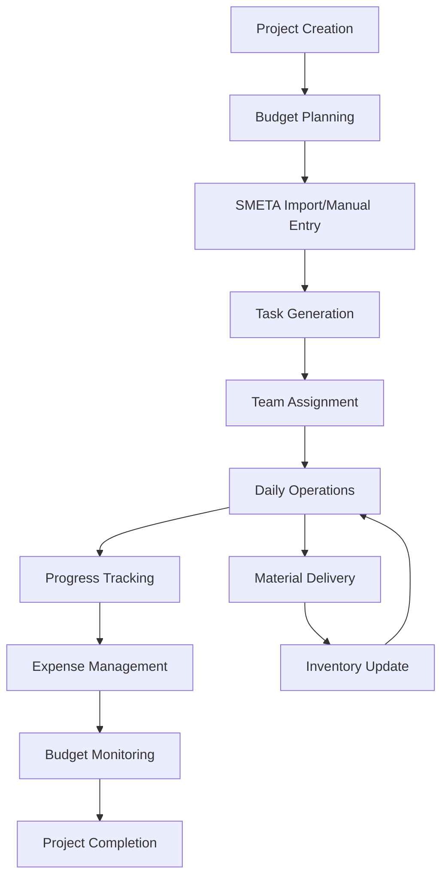

# Construction Management System - Complete Specification

## 📋 Executive Summary

A comprehensive, mobile-first construction management ecosystem built on Odoo 17 Community Edition. This system provides end-to-end project management from budget planning to field execution, designed specifically for construction companies needing integrated financial tracking, materials management, and mobile field operations.

---

## 🏗️ System Overview

### Core Value Proposition
- **Unified Platform**: Single system for all construction management needs
- **Mobile-First**: Optimized for field workers and on-site management
- **Cost Control**: Real-time budget tracking and expense management
- **Role-Based**: Tailored interfaces for different construction roles
- **Integration Ready**: Seamless data flow between all modules

### Target Industries
- General Construction
- Residential Development
- Commercial Building
- Infrastructure Projects
- Renovation & Remodeling

---

## 👥 User Personas & Stories

### 1. Construction Project Manager (Primary User)
**Profile**: Oversees multiple projects, responsible for budgets, timelines, and team coordination

**User Stories**:
- *"As a PM, I need a dashboard showing all my projects' status so I can quickly identify issues"*
- *"I want to approve expenses on my mobile device while visiting job sites"*
- *"I need real-time budget alerts when projects approach spending limits"*
- *"I want to track team productivity and task completion across projects"*

**Daily Workflow**:
1. Check PM Dashboard for project overview
2. Review and approve pending expenses
3. Monitor budget utilization alerts
4. Update project timelines and assign tasks
5. Communicate with site managers via mobile

### 2. Site Manager/Foreman (Field User)
**Profile**: On-site supervisor managing daily operations, workers, and immediate needs

**User Stories**:
- *"As a site manager, I need to update task status quickly on my phone"*
- *"I want to submit expenses with photos while in the field"*
- *"I need to log material deliveries and track inventory"*
- *"I want to see today's tasks and priorities on a simple mobile interface"*

**Daily Workflow**:
1. Open mobile dashboard to see daily tasks
2. Update task progress throughout the day
3. Log material deliveries as they arrive
4. Submit expenses with receipt photos
5. Communicate issues to project manager

### 3. Provision Manager (Materials Specialist)
**Profile**: Manages materials procurement, delivery tracking, and inventory across projects

**User Stories**:
- *"I need to quickly add common materials to projects from templates"*
- *"I want to track material deliveries with supplier information and costs"*
- *"I need real-time inventory levels for each project"*
- *"I want to export material usage reports for accounting"*

**Daily Workflow**:
1. Process incoming material deliveries
2. Update inventory levels in the system
3. Use quick-add templates for common materials
4. Monitor stock levels across projects
5. Generate material cost reports

### 4. Construction Accountant (Financial Oversight)
**Profile**: Manages financial aspects, expense approval, and budget compliance

**User Stories**:
- *"I need to review all expenses before they're approved for payment"*
- *"I want to see budget vs. actual spending across all projects"*
- *"I need to export financial data for our accounting system"*
- *"I want automated alerts when projects exceed budget thresholds"*

**Daily Workflow**:
1. Review expense approval queue
2. Analyze budget variance reports
3. Monitor financial alerts and notifications
4. Export data for external accounting
5. Generate financial reports for management

---

## 🔧 Technical Architecture

### System Infrastructure
```
┌─────────────────┐    ┌─────────────────┐
│   Docker Host   │    │  PostgreSQL DB  │
│                 │    │                 │
│  Odoo 17 CE     │◄──►│  Construction   │
│  Construction   │    │  Database       │
│  Modules        │    │                 │
└─────────────────┘    └─────────────────┘
```

### Module Architecture
```
┌─────────────────┐
│  Core Platform  │
│  (Odoo 17 CE)   │
└─────────────────┘
         │
    ┌────┴────┐
    ▼         ▼
┌─────────┐ ┌─────────┐
│Business │ │Support  │
│Modules  │ │Modules  │
└─────────┘ └─────────┘
```

---

## 📱 Module Specifications

### 1. Construction Budget Management
**Module**: `construction_budget`

**Purpose**: Comprehensive financial planning and tracking

**Key Features**:
- Hierarchical budget categories
- Line-item budget tracking with quantities and units
- Real-time budget vs. actual calculations
- Budget approval workflow
- Over-budget alerts (90% threshold)
- Integration with expenses and purchase orders

**Data Models**:
```python
construction.project.budget
├── budget_lines (One2many)
├── total_budget (Computed)
├── spent_amount (Computed)
├── remaining_budget (Computed)
└── utilization_percentage (Computed)

construction.project.budget.line
├── category_id (Many2one)
├── description (Char)
├── quantity (Float)
├── unit_price (Float)
├── total_amount (Float)
└── spent_amount (Computed)
```

**User Interface**:
- Budget planning wizard
- Category-based budget breakdown
- Budget vs. actual dashboard
- Expense integration views

### 2. Project Manager Dashboard
**Module**: `construction_pm_dashboard`

**Purpose**: Real-time project oversight and management

**Key Features**:
- Multi-project overview cards
- Responsive kanban task management
- Budget monitoring with alerts
- Team activity tracking
- Mobile-responsive design

**Dashboard Components**:
- **Project Cards**: Progress, completion, budget status
- **Task Board**: Kanban view with drag-and-drop
- **Budget Monitor**: Category breakdown with alerts
- **Team Overview**: Active workers, pending approvals
- **Activity Feed**: Recent updates and changes

**Responsive Design**:
- Desktop: Multi-column layout
- Tablet: Adaptive grid layout
- Mobile: Stacked cards with navigation

### 3. Construction Provision Manager
**Module**: `construction_provision_manager`

**Purpose**: Materials and inventory management

**Key Features**:
- Project-based material tracking
- Delivery logging with supplier info
- Pre-defined material templates
- Real-time inventory calculations
- Mobile-optimized interface
- Export capabilities

**Data Models**:
```python
construction.material.delivery
├── project_id (Many2one)
├── material_name (Char)
├── quantity (Float)
├── unit_price (Float)
├── supplier_info (Char)
├── delivery_date (Datetime)
├── consumed_quantity (Float)
└── remaining_quantity (Computed)

construction.project.material
├── project_id (Many2one)
├── material_name (Char)
├── total_delivered (Computed)
├── total_consumed (Computed)
├── current_stock (Computed)
└── status (Selection)
```

**User Workflows**:
1. **Quick Add Material**: Fast entry with templates
2. **Delivery Tracking**: Log incoming materials
3. **Inventory Management**: Track stock levels
4. **Consumption Recording**: Update usage
5. **Reporting**: Export for accounting

### 4. Mobile Site Manager
**Module**: `construction_mobile_manager`

**Purpose**: Field-optimized mobile interface

**Key Features**:
- Simplified mobile dashboard
- Touch-friendly task management
- Mobile expense entry
- Photo upload capabilities
- Offline-ready design

**Mobile Optimizations**:
- Large touch targets (minimum 44px)
- Bottom navigation for thumb access
- Simplified forms
- Quick action buttons
- Gesture support

### 5. SMETA Import System
**Module**: `construction_smeta_import`

**Purpose**: Excel budget import for Eastern European markets

**Key Features**:
- Excel file upload (.xls, .xlsx)
- Column mapping interface
- Russian text support
- Data validation and preview
- Automatic budget line creation

**Import Process**:
1. Upload Excel file
2. Map columns to system fields
3. Preview and validate data
4. Import with error handling
5. Create budget structure

---

## 🔐 Security & Access Control

### User Role Matrix

| Feature | Admin | PM | Site Mgr | Accountant | Provision Mgr |
|---------|-------|----|---------|-----------| -------------|
| Create Projects | ✅ | ✅ | ❌ | ❌ | ❌ |
| Manage Budgets | ✅ | ✅ | 👁️ | ✅ | 👁️ |
| Approve Expenses | ✅ | ✅ | ❌ | ✅ | ❌ |
| Update Tasks | ✅ | ✅ | ✅ | ❌ | ❌ |
| Material Delivery | ✅ | ✅ | ✅ | 👁️ | ✅ |
| Financial Reports | ✅ | ✅ | ❌ | ✅ | ❌ |

*Legend: ✅ Full Access, 👁️ Read Only, ❌ No Access*

### Data Security
- Project-based access restrictions
- Role-based menu visibility
- Field-level security
- Audit trail for all changes
- Secure API endpoints

---

## 📊 Business Workflows

### Project Lifecycle Workflow



### Daily Operations Flow

**Morning Planning**:
1. PM checks dashboard for project status
2. Site managers review daily tasks
3. Provision manager checks material deliveries

**Field Execution**:
4. Workers update task progress
5. Materials delivered and logged
6. Expenses submitted with photos

**Evening Review**:
7. PM reviews progress and approvals
8. Accountant processes expenses
9. Budget alerts reviewed and addressed

---

## 📱 Mobile Experience

### Mobile-First Design Principles

**Touch Optimization**:
- Minimum 44px touch targets
- Large input fields for field use
- Swipe gestures for navigation
- Pull-to-refresh functionality

**Field Conditions**:
- High contrast for outdoor visibility
- Simplified workflows
- Offline capability indicators
- Quick photo capture

**Performance**:
- Optimized for 3G/4G networks
- Compressed images
- Cached data for offline use
- Fast loading times

### Mobile Workflows

**Site Manager Mobile Journey**:
1. **Login** → Simple authentication
2. **Dashboard** → Today's tasks overview
3. **Task Update** → Quick status change
4. **Expense Entry** → Photo + basic info
5. **Material Log** → Delivery confirmation

**Mobile UI Components**:
- Bottom navigation bar
- Floating action buttons
- Collapsible sections
- Modal dialogs for quick actions
- Card-based layouts

---

## 📈 Reporting & Analytics

### Real-Time Dashboards

**Project Manager Dashboard**:
- Project progress indicators
- Budget utilization charts
- Team productivity metrics
- Task completion rates
- Recent activity feed

**Financial Dashboard**:
- Budget vs. actual graphs
- Expense approval queues
- Cost breakdown by category
- Spending trend analysis

### Export Capabilities

**Standard Reports**:
- Project budget summary
- Material usage reports
- Expense reports by period
- Team productivity reports
- Financial variance analysis

**Export Formats**:
- Excel (.xlsx) for accounting
- PDF for stakeholder reports
- CSV for data analysis
- Print-friendly layouts

---

## 🚀 System Benefits

### Operational Efficiency
- **30% reduction** in manual data entry
- **Real-time visibility** into project status
- **Automated calculations** for budgets and inventory
- **Mobile accessibility** for field workers

### Financial Control
- **Budget compliance** monitoring
- **Expense approval** workflows
- **Cost tracking** by category
- **Financial reporting** automation

### Communication
- **Centralized information** access
- **Real-time updates** across teams
- **Mobile notifications** for urgent items
- **Photo documentation** for issues

### Scalability
- **Multi-project** management
- **Role-based access** for teams
- **Modular architecture** for growth
- **Integration ready** for other systems

---

## 🔧 Installation & Setup

### System Requirements
- Docker Desktop or Docker Engine
- 4GB RAM minimum (8GB recommended)
- 20GB storage space
- Network access for updates

### Quick Start
```bash
# Clone repository
git clone [repository-url]

# Start system
docker compose up -d

# Access system
http://localhost:8069
```

### Initial Configuration
1. Create admin user
2. Install construction modules
3. Set up user roles
4. Configure budget categories
5. Load material templates

---

## 🔮 Future Roadmap

### Short Term (3-6 months)
- Barcode scanning for materials
- Push notifications for mobile
- Gantt chart project timelines
- Weather integration for outdoor work

### Medium Term (6-12 months)
- GPS tracking for workers
- Time tracking integration
- Equipment management module
- Document management system

### Long Term (12+ months)
- AI-powered project insights
- IoT sensor integration
- Advanced analytics and BI
- Third-party accounting integration

---

## 📞 Support & Documentation

### User Training
- Role-specific training materials
- Video tutorials for common tasks
- Mobile app usage guides
- Best practices documentation

### Technical Support
- System administration guide
- Troubleshooting documentation
- API documentation for integrations
- Backup and recovery procedures

---

*This specification represents a complete, production-ready construction management system designed for modern construction companies requiring integrated project management, financial control, and mobile field operations.*